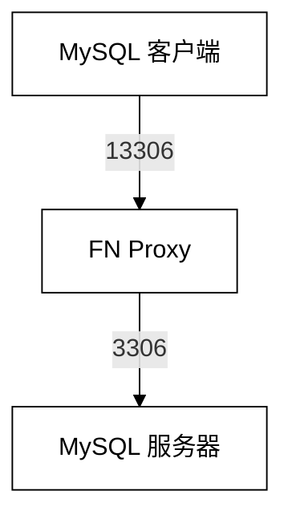

# FN-database

一个关于 MySQL 数据库的中间件，支持范式，需要用户手写依赖



## 范式相关 SQL 语法
todo

## 依赖与编译

Ubuntu / Debian：

```bash
sudo apt update
sudo apt install -y build-essential cmake libboost-system-dev

cmake -S . -B build
cmake --build build -j
```

生成的程序是 `build/fn_proxy`。

## 启动

使用默认配置（监听 `0.0.0.0:13306`，连接 `127.0.0.1:3306`）：

```bash
./build/fn_proxy
```

完整参数：

```bash
./build/fn_proxy \
  --listen-host 0.0.0.0 \
  --listen-port 13306 \
  --mysql-host 127.0.0.1 \
  --mysql-port 3306
```

查看帮助：

```bash
./build/fn_proxy --help
```

`--listen-host` 当前应为数字形式的 IPv4/IPv6 地址；`--mysql-host` 可以是 IP 或可解析的主机名。

## 使用真实 MySQL 测试

先确认 MySQL 正在 `127.0.0.1:3306` 监听，再通过代理连接：

```bash
mysql -h 127.0.0.1 -P 13306 -u root -p --protocol=TCP
```

登录后可执行完整的读写测试：

```sql
SHOW DATABASES;
CREATE DATABASE fn_test;
USE fn_test;
CREATE TABLE users (id INT PRIMARY KEY, name VARCHAR(50));
INSERT INTO users VALUES (1, 'Alice');
SELECT * FROM users;
UPDATE users SET name = 'Bob' WHERE id = 1;
DELETE FROM users WHERE id = 1;
SHOW TABLES;
DROP DATABASE fn_test;
```

所有行为应与直连 `3306` 相同。代理日志会显示连接建立、断开以及每次实际转发的字节数。


