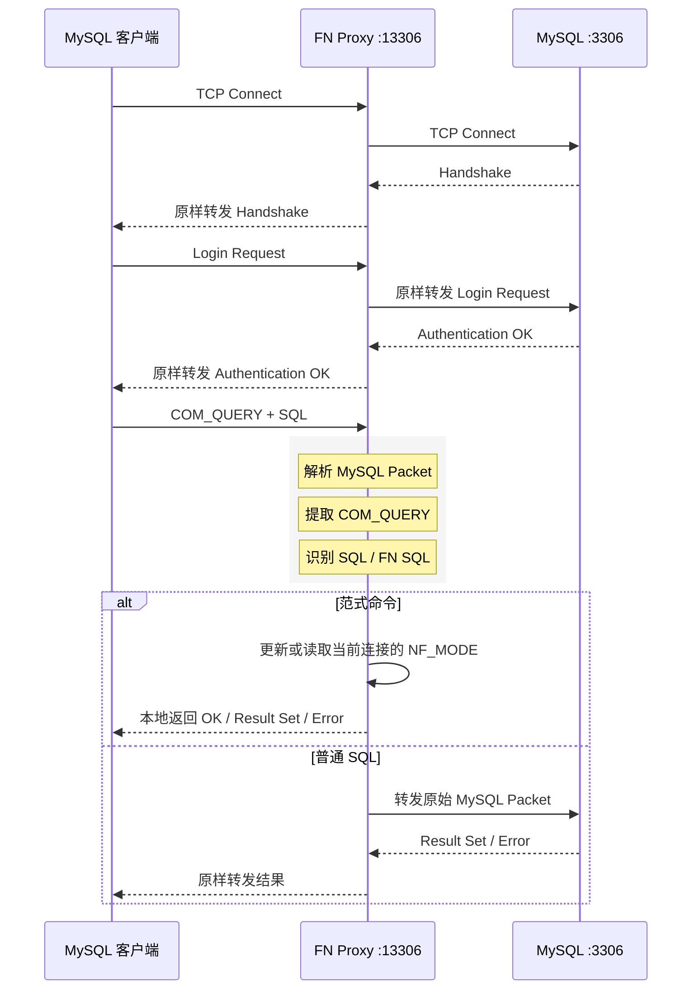

# FN-database

一个关于 MySQL 数据库的中间件，支持范式，需要用户手写依赖


```mermaid
sequenceDiagram
    participant Client as MySQL 客户端
    participant Proxy as FN Proxy :13306
    participant MySQL as MySQL :3306

    Client->>Proxy: TCP Connect
    Proxy->>MySQL: TCP Connect

    MySQL-->>Proxy: Handshake
    Proxy-->>Client: 原样转发 Handshake

    Client->>Proxy: Login Request
    Proxy->>MySQL: 原样转发 Login Request

    MySQL-->>Proxy: Authentication OK
    Proxy-->>Client: 原样转发 Authentication OK

    Client->>Proxy: COM_QUERY + SQL

    rect rgb(245, 245, 245)
        Note over Proxy: 解析 MySQL Packet
        Note over Proxy: 提取 COM_QUERY
        Note over Proxy: 识别 SQL / FN SQL
    end

    alt 范式命令
        Proxy->>Proxy: 更新或读取当前连接的 NF_MODE
        Proxy-->>Client: 本地返回 OK / Result Set / Error
    else 普通 SQL
        Proxy->>MySQL: 转发原始 MySQL Packet
        MySQL-->>Proxy: Result Set / Error
        Proxy-->>Client: 原样转发结果
    end
```

## 范式相关 SQL 语法

当前正式项目使用 ANTLR4 4.13.2 识别以下自定义语句，关键字不区分大小写，末尾分号可选：

```sql
SET NF_MODE = 2NF;
SET NF_MODE = 3NF;
SET NF_MODE = BCNF;
SET NF_MODE = OFF;

SHOW NF_MODE;
```

代理会在本地处理这些命令，不再把它们转发给 MySQL：

- `SET NF_MODE = ...` 更新当前客户端连接的模式并返回 MySQL OK；
- `SHOW NF_MODE` 返回只有 `NF_MODE` 一列、一行的 MySQL Result Set；
- 每个客户端连接的初始模式都是 `OFF`，连接之间互不影响；
- 形似范式命令但语法错误的输入会返回 MySQL `1064 / SQLSTATE 42000`；
- 兼容 MySQL 8 客户端通过 `CLIENT_QUERY_ATTRIBUTES` 发送的空查询属性头；
- 普通 MySQL SQL 不进入 NF Parser，仍然透明转发给后端。

正式 grammar 位于 `grammar/FNCommand.g4`，生成的 C++ Lexer / Parser 位于 `generated/`。学习用的完整 Demo 位于 [`docs/antlr-demo/`](docs/antlr-demo/README.md)。两者共用 `third_party/` 中的 ANTLR Generator 和 C++ Runtime 4.13.2。

修改正式 grammar 后，在仓库根目录重新生成：

```bash
cd grammar
java -jar ../third_party/antlr-4.13.2-complete.jar \
  -Dlanguage=Cpp \
  -no-listener \
  -o ../generated \
  FNCommand.g4
cd ..
```

## 依赖与编译

Ubuntu / Debian：

```bash
sudo apt update
sudo apt install -y build-essential cmake libboost-system-dev

cmake -S . -B build
cmake --build build -j
```

生成的程序是 `build/fn_proxy`。

## 启动

使用默认配置（监听 `0.0.0.0:13306`，连接 `127.0.0.1:3306`）：

```bash
./build/fn_proxy
```

完整参数：

```bash
./build/fn_proxy \
  --listen-host 0.0.0.0 \
  --listen-port 13306 \
  --mysql-host 127.0.0.1 \
  --mysql-port 3306
```

查看帮助：

```bash
./build/fn_proxy --help
```

`--listen-host` 当前应为数字形式的 IPv4/IPv6 地址；`--mysql-host` 可以是 IP 或可解析的主机名。

## 使用真实 MySQL 测试

先确认 MySQL 正在 `127.0.0.1:3306` 监听，再通过代理连接：

```bash
mysql -h 127.0.0.1 -P 13306 -u root -p \
  --protocol=TCP --ssl-mode=DISABLED
```

当前代理只能在明文 MySQL Classic Protocol 中识别自定义 SQL，因此测试范式命令时必须关闭客户端 TLS，也不要启用 MySQL 压缩。TLS 或压缩连接仍可透明转发，但代理不会读取或处理其中的范式命令。

登录后可执行完整的读写测试：

```sql
SHOW DATABASES;
CREATE DATABASE fn_test;
USE fn_test;
CREATE TABLE users (id INT PRIMARY KEY, name VARCHAR(50));
INSERT INTO users VALUES (1, 'Alice');
SELECT * FROM users;
UPDATE users SET name = 'Bob' WHERE id = 1;
DELETE FROM users WHERE id = 1;
SHOW TABLES;
DROP DATABASE fn_test;
```

范式命令测试：

```sql
SHOW NF_MODE;
SET NF_MODE = 2NF;
SHOW NF_MODE;
SET NF_MODE = 3NF;
SET NF_MODE = BCNF;
SET NF_MODE = OFF;
```

普通 SQL 的行为应与直连 `3306` 相同。代理日志会显示连接建立、断开、本地处理的范式命令以及实际转发的字节数。

## 测试

```bash
ctest --test-dir build --output-on-failure
python3 tests/smoke_fake_mysql.py
```

冒烟测试会启动一个假的 MySQL 后端，验证普通 SQL 原样转发、范式命令不进入后端，以及 `SHOW NF_MODE` 返回当前连接的模式。
